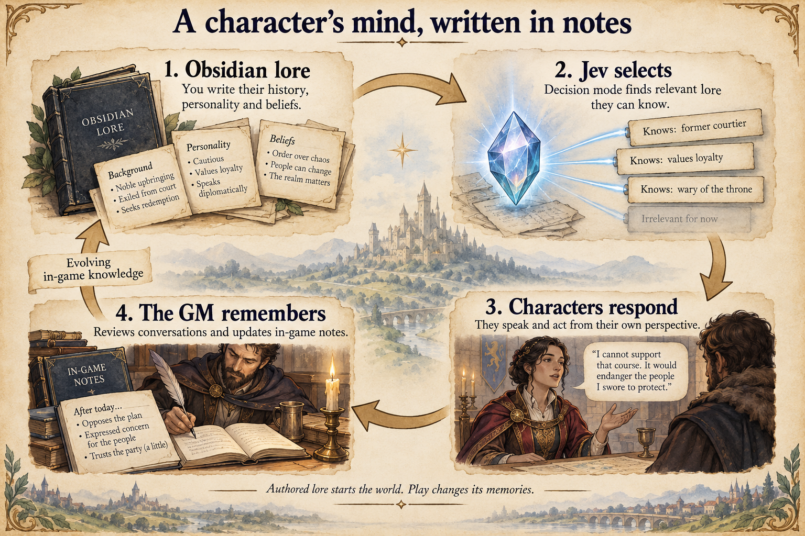

# Kingmaker

Kingmaker is an AI-powered fantasy roleplaying sandbox chasing the tabletop
promise: **“What do you want to do?”** Speak in your own words, invent a scheme,
change your mind, and give the court something unexpected to react to. AI plays
the characters and game master, drawing on their lore to improvise responses
and carry the consequences of your conversations forward.

A royal court full of powerful people, all expecting to get their own way.
Your patron, the Laughing Stranger, has sent you to cause a little trouble.

**[Play the browser demo](https://tatskaari.github.io/kingmaker/)** — requires
an OpenRouter API key and credit for model usage.

## Welcome to court

The Centennial Assembly has brought the royal court of Caerwyn together with
agricultural wizards from Nine Furrows, dwarves from Kläggenheim, and Saltmere's
maritime delegation. Every hundred years, the kingdoms must recognise a common
sovereign. Everyone arrives with their own interests, loyalties and reasons to
want things done differently.

You choose who you are and how you fit in. A visiting performer? A guard with
connections? An independent traveller with an excellent cover story? The
Stranger helps you find a place at court. You don't need to study the lore first.

## What do you do?

- **Make a character.** Invent your identity, background and relationships in
  conversation with the Stranger, or choose a pre-made traveller to jump in.
- **Talk your way into trouble.** Ask questions, make a case, bluff or provoke.
  Conversations use your own words, with skill checks when the game calls for them.
- **Explore the palace.** Walk between rooms, approach courtiers, inspect objects
  and look through containers. Some actions can get you into trouble.
- **Interfere in people's plans.** Characters can remember encounters, form
  intentions, move around the palace and speak to one another. See what happens
  when you give them a reason to act.

## Edit their brains in Obsidian

The characters' minds start as linked Markdown notes: their histories,
personalities, motives, relationships and beliefs. Open the repository's
[`lore/`](lore/index.md) folder as an Obsidian vault and you can rewrite what
makes them tick. Give a courtier a grudge, change who they trust, or write a
piece of history they remember. Those notes become the foundations of their
roleplaying.

When a character needs context, **Jev, the decision mode, picks out the relevant
lore** from notes that character is allowed to know. They can draw on a web of
personal knowledge while other people's secrets stay private.

After conversations, **the GM reviews what happened and updates the characters'
in-game notes and intentions**. What they've learned and what they want to do
next can change through play, keeping the world and its inhabitants dynamic.

To try your own edits, [run the game locally](docs/development.md#run-locally)
and start a fresh game with the updated lore. Playthrough memories live in the
save; the GM doesn't overwrite your authored Obsidian vault. The
[lore authoring guide](lore/Authoring/Authoring%20Guide.md) explains how to write
and link notes and decide who knows what.

## What's playable now?

This is an early tech demo focused on character creation, conversations, palace
exploration and reactive characters. Expect rough edges and variable AI responses.

The assembly supplies the political stakes, but time progression and the formal
recognition of a sovereign aren't implemented yet. There isn't a complete campaign
to finish or a throne you can win through a working election system.

## Start playing

1. Open the **[browser demo](https://tatskaari.github.io/kingmaker/)** and enter
   your OpenRouter API key. Dialogue and other AI activity use your account's credit.
2. Choose **Create a custom character** to meet the Stranger, or **Play a pre-made
   character** to choose a ready-made traveller.
3. If you create your own character, review and save the character you make
   together, then enter the palace.
4. **Left-click to walk. Right-click to interact** with characters, doors and
   objects. Try introducing yourself to someone in the hall.

Games are saved in your browser. Your API key is remembered in that browser too,
separately from your saves; **Change OpenRouter key** removes it. Updates may
require a fresh game because older save formats aren't upgraded.

## For contributors

To run the game locally or explore how it works, start with the
[development guide](docs/development.md). It links to architecture notes,
debugging tools, validation commands and the lore authoring vault.
