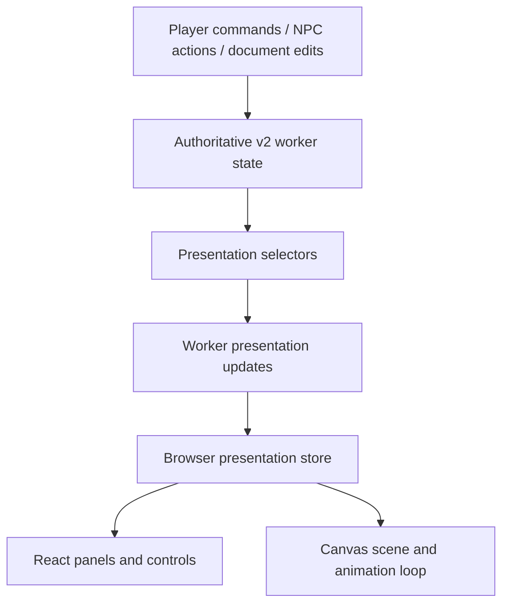

# RFC 0001: Direct world mechanics and React/canvas presentation

- Status: Proposed
- Date: 2026-10-04
- Scope: Native document-based world support and React/canvas presentation
- Related work: [service separation #330](https://github.com/Tatskaari/kingmaker/pull/330),
  [incremental document graph #331](https://github.com/Tatskaari/kingmaker/pull/331)

## Problem and evidence

The v2 world owns documents and physical state, but live mechanics still consume
v1 `Scenario`. `WorldHost.projection()` copies state into a temporary
`PalaceMechanics`; `mutate()` serializes its result and copies mechanics back.
Views reconstruct the same representation. Worker persistence, map presentation,
action responses and NPC progress each have paths that build or publish views.
This makes ordinary movement expensive and UI refresh ownership unclear.

Fresh-world headless measurements on 2026-10-03 compared the refactor-only branch
with the incremental-graph branch, using 20 iterations after three warm-ups:

| Operation | Before graph fix, median | After graph fix, median |
| --- | ---: | ---: |
| v2 movement mutation | 133 ms | 40 ms |
| Full headless movement | 200 ms | 102 ms |
| Browser-equivalent CPU sequence | 307 ms | 210 ms |
| Single document body edit | 215 ms | 9 ms |

The browser-equivalent sequence includes rollback/save snapshots, command execution,
map observation and three views. It excludes IndexedDB, transport, DOM rendering
and model calls. These are local diagnostic measurements, not frame-rate guarantees.
The graph fix removes lore parsing from movement; world copying, conversion and
observation costs remain. That fix is separate from this proposed migration.

## Decision

This RFC proposes two refactors:

1. Make game logic natively consume the document-based scenario and its physical
   state, removing the reconstruction of a legacy `Scenario` for mechanics and views.
2. Make presentation consume that state through React subscriptions and a canvas
   render loop, removing scattered defensive view rebuilds and refresh calls.

Keep one authoritative v2 world in the game worker. Documents own narrative content
and incremental link maintenance. Mechanics use the physical map and character
properties directly. React renders panels and controls; an independent canvas loop
renders prepared scene data. Gameplay code does not choose UI components to refresh,
and presentation reads must not mutate authoritative world state.

### Out of scope

This RFC does not introduce a transaction API, compare-and-swap (CAS) design, new
resource-generation scheme, draft/patch engine, or replacement persistence/rollback
strategy. Preserve existing validation, conflict detection and save behavior while
changing the representations they operate on. Any redesign of those mechanisms
requires a separate proposal; it is not a prerequisite for either refactor here.

## Target state and ownership

The proposed protobuf shape is below. Supporting map and D&D messages are omitted;
this is a design sketch, not a generated contract. Retain existing field numbers
where meanings are unchanged and reserve retired numbers during implementation.

```proto
message WorldState {
  map<string, Document> docs = 1;
  reserved 2, 6; // Old character-path list and player document reference.
  string scenario = 3;
  MapState map = 4;
  string scenario_index = 5;
  map<string, CharacterState> characters = 7; // Keyed by stable character ID.
  optional string player_character_id = 8;
}

message Document {
  google.protobuf.Struct frontmatter = 1;
  string body = 2;
  repeated DocumentLink links = 3;
  reserved 4; // Former character_properties.
}

message CharacterState {
  string document_path = 1;
  DndCharacter dnd = 2;
  Inventory inventory = 3;
}
```

`MapState` names the existing physical simulation concept: actors, rooms, doors,
fixtures, day, phase and physical facts. Static `WorldMap` tile geometry remains
separate. Shared types need not be rewritten simply because their namespace is v1.
The obsolete dependency is the aggregate `Scenario`, not every v1 protobuf type.

Actors reference character IDs and own tile positions. They are not stored inside
tiles. Preserve distinct actor instance IDs for multiple background bodies sharing
one character identity. A derived tile-to-actor-instance index supports occupancy
queries; rebuild it on load and update it atomically with positions. Do not persist
a second authoritative copy of occupancy.

Characters own statistics and inventory; fixtures and rooms retain their inventories.
Documents retain biography, speech style, beliefs, relationships and narrative goals.
Names and sprite metadata can be selected from character documents without copying
their prose into a second character model. Character registration explicitly creates
the ID/document association; deleting its entry document requires deregistration or
reassignment. Scenario document links no longer implicitly redefine mechanical IDs.

Conversation history, NPC execution state, generations and the Stranger interview
remain in the surrounding session snapshot. Character creation publishes its document,
mechanical record, actor and player designation atomically. Moving mechanics out of
documents must not make private statistics visible to a character or the ordinary UI.
Incompatible schema changes require a fresh game; no saved-game migration is added.

## Native world access

Refactor movement, inventory, fixture, NPC and observation functions to consume the
v2 map, character mechanics and document services they actually need. Remove the
`Scenario` projection, disposable mechanics state and serialization round trip from
ordinary operations. A move updates an actor's physical state without reconstructing
character lore or copying the document world.

Keep existing command validation and concurrency protections in place. Preserve
incremental document graph maintenance and its dangling-link, ambiguity and audience
checks. Existing save/load and failure behavior remain requirements, rather than
mechanisms redesigned by this RFC.

View construction becomes read-only. Persistence reads the metadata it needs directly
instead of constructing UI views to discover a player name. This removes unnecessary
presentation work without changing when saves occur or how failures are handled.

## Presentation and worker boundary



Selectors declare the state they read; dependency tracking and comparison determine
which outputs change. Start with a small set of stable outputs: map scene, player
sheet, visible characters, active conversation and explicitly requested debug data.
The subscription mechanism is an implementation choice, to be proved in the first
vertical slice. Do not assume React detects arbitrary object mutations. Centralize
presentation notification at the existing successful state-change boundary; game
operations do not carry lists of UI components to refresh.

The browser keeps presentation data received from the worker and exposes it through
a store. Send initial data when opening a game, then update affected presentation
slices through one consistent path. Preserve unchanged slice identities so unrelated
subscribers do not rerender. Do not ship the entire document world on every step.
Retain existing reset/load cancellation and prevent obsolete session updates from
replacing the active view. The wire format is an implementation detail, not a new
concurrency protocol. Apply visibility and lore permissions before producing ordinary
views; GM/debug subscriptions stay explicit.

React components subscribe to the slices they need using `useSyncExternalStore`
(or a library built on it). Snapshots must be immutable and stable between changes.
Keep canvas animation positions outside React state. The canvas component owns
renderer setup, resize handling and cleanup, not authoritative game state.

The canvas loop reads the latest prepared scene and uses elapsed time to interpolate
movement. It can skip drawing while scene, camera and animation state are unchanged.
Cache static terrain; profile before introducing dirty-region rendering. No frame
may build a `Scenario`, parse lore, call `runtime.view()` or enumerate game actions.
Pause/resume and throttled frames must not affect simulation correctness. The existing
embedded-browser timing workaround requires validation before changing animation timing.

Thinking indicators, streamed dialogue and errors are separate transient updates,
scoped by session and request IDs. They do not republish the map. Remove defensive
refresh calls from persistence, NPC progress and action responses as consumers move
to subscriptions. Commands return results/errors; committed state arrives through
one publication path. Browser input continues to send commands to the worker.

## Migration sequence

Deliver buildable, independently reviewable stack layers, splitting each slice as needed:

1. **State ownership:** introduce character IDs and separate mechanical records;
   update fresh-world loading, character creation and save validation. Require a fresh game.
2. **Native player movement:** move player movement and doors off the `Scenario`
   round trip using direct physical-state access. Preserve existing validation and
   conflict handling; test movement and occupancy behavior headlessly.
3. **Remaining mechanics:** migrate inventory/fixture operations, NPC actions and events
   to narrow v2 access. Retain existing movement, legality and inventory rules.
4. **Presentation vertical slice:** connect one actor and one React panel through
   worker presentation updates and stable browser snapshots. Verify that
   dialogue streaming does not redraw the map and movement does not rebuild unrelated panels.
5. **Remaining presentation:** migrate views, controls and debug tools; remove redundant
   publications, including view construction inside persistence. Keep canvas rendering
   independent of React render frequency and preserve existing save behavior.
6. **Delete legacy paths:** migrate headless entrypoints, tests and eval fixtures;
   remove `projectWorld()`, disposable `PalaceMechanics` state and remaining live
   `Scenario` consumers. Temporary adapters must have named remaining consumers and
   be removed before the migration is complete; do not maintain a compatibility runtime.

## Validation and completion criteria

Preserve collision/access rules, inventory uniqueness and equipment cleanup, character
visibility, document permissions, NPC cancellation and concurrent conversation behavior.
Retain regression coverage for failed persistence, stale commands, creation/deletion,
reset during async work, and multiple actor instances. Exercise canvas lifecycle and UI state
preservation: focus, scroll, dialogue drafts and animation must survive ordinary updates.

Repeat the same headless movement and document benchmarks on each relevant layer.
Instrument time spent in mechanics, selectors, serialization, transport and drawing;
report allocations and update counts as well as median/tail latency. In a browser,
check idle drawing and simultaneous NPC movement/dialogue streaming.

Completion means no live `Scenario` projection, no document parsing or full-world
copy inside movement mechanics, read-only views, and one state-change-to-presentation path.
React updates subscribed slices and canvas frames consume prepared data. Full saves
remain valid for the current format. Every stack passes the repository checks/build;
performance gains must be measured rather than assumed from the framework choice.

## References

- Current contracts: [v2 world](../../packages/contracts/proto/kingmaker/v2/world.proto),
  [physical map and actors](../../packages/contracts/proto/kingmaker/v1/game.proto).
- Current adapters: [world host](../../apps/web/src/world-host.ts),
  [world projection](../../apps/web/src/world-projection.ts).
- [React: useSyncExternalStore](https://react.dev/reference/react/useSyncExternalStore)
- [React: useRef](https://react.dev/reference/react/useRef)
